<!-- Small shortcut -->


<a href="assets/images/pastel-cat.jpg">
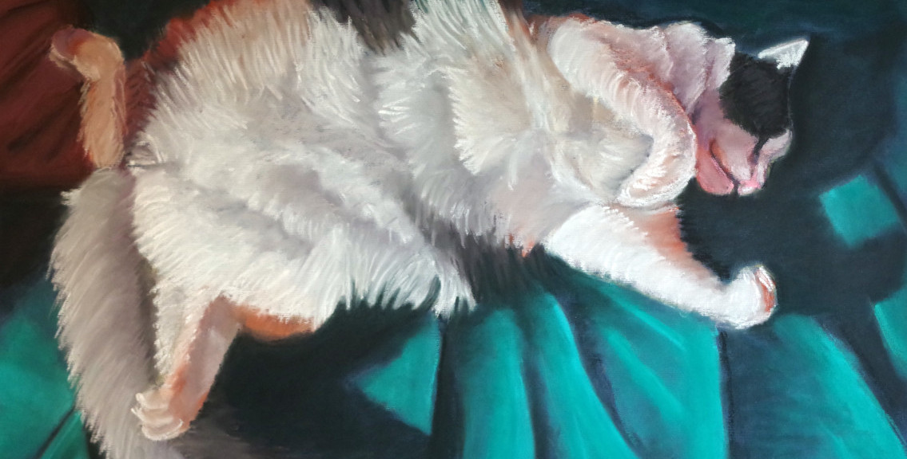
</a>
<figcaption>Cat, <i>Pastel on Ingres paper, 50x65cm</i></figcaption>

A few years ago I adopted the habit of practicing a personal activity every day,
or at least once a week when I'm busy.  I regularly go back and forth between
pursuing new interests and rekindling old passions, but whatever the topic I
always practice with dedication.

The passion I originally had for [drawing](#fine_arts) quickly grew to [computer
graphics](#computer_graphics), which in turn is the [reason why I discovered
computer programming](https://github.com/sonmarcho/CrowdEngine). Following a
stint in China in 2019, I have also been working hard on [learning Chinese](#chinese).

## Fine Arts 

I have always been fond of drawing but was not very disciplined when in middle
and high school.
Once a student at *École polytechnique*, I adopted a more regular practice by
joining the fine arts association. I then spent most of my time experimenting
and trying to use colors, and had a hard time finding a technique which suited
me.
I then didn't manage to make much of oil pastel and oil paint and was not convinced
by acrylic. As a result, I didn't improve my skills much during this period,
though I intend to give another shot at oil paint as the problem was not that
the technique didn't suit me, but rather that it requires some technicity which
I need to take time to master.

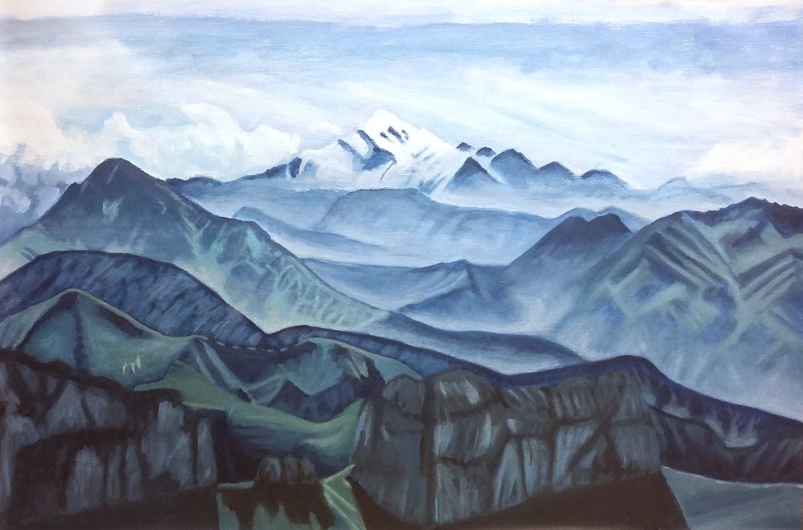

<figcaption>Mont-Blanc, <i>Acrylic on canvas.</i></figcaption>

After my graduation, I discovered soft pastel and immediately became fond of
this technique. It really feels like drawing, but with colors, and thus seemed
very natural. It is also very
easy to fix a mistake or blend colors, leading to a lot of freedom, and the only
major drawback is the
fragility of the result - I'm actually having a hard time storing my drawings.

  

  

  <b>The popularisation of pastel in the 18th century</b>, the golden
  age of pastel, was
  actually greatly facilitated by the invention of two efficient preservation
  techniques: fixative, which would be spread on the back of a drawing to hold
  pastel powder in place, and flat glass, to cover paintings and drawings.
  <small>Source: <i>Pratique des arts</i>, special issue n°44, July 2017</small>
  

 

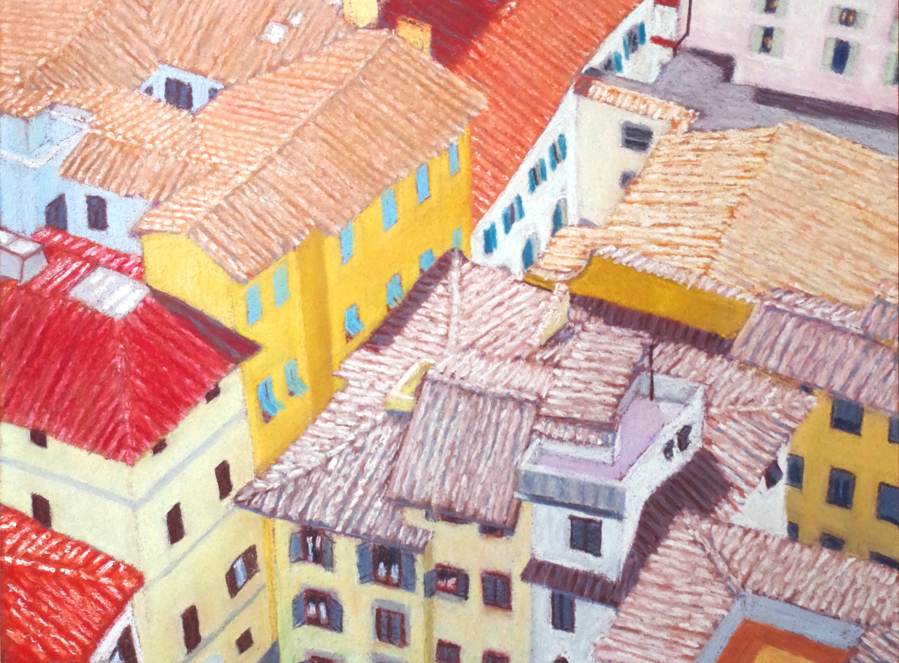
<figcaption>Florence, <i>detail, Pastel, 50x65cm</i></figcaption>

  

  

  <b>Technical note</b>: 

  

  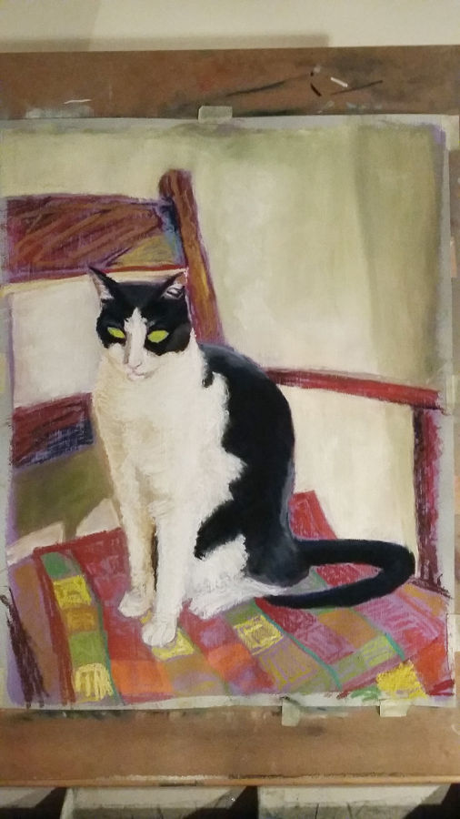
  <figcaption>Cat (work in progress) on paper  prepared with pumice stone powder</figcaption>
  

  

  I often read that a good way of redoing part of a pastel
  drawing is to use an eraser.
  I'm not very fond of this technique, and prefer
  using a bruch with stiff hair. Using a brush is a lot more precise,
  allowing you to remove pastel exactly where you need to and
  thus without the risk of damaging the surrounding areas.
  It also works
  well at removing the excess of pastel once the paper has reached
  saturation. As all the layers of pastel powder blend a bit, by gently
  scratching the surface you can
  reveal one of the inner layers, which in practice is often similar to the
  top one. This allows you to desaturate the paper without destroying your work,
  leaving room for corrections.
  

  

  I sometimes quickly sketch the model I'm drawing by using
  colored pencils, before working with pastels sticks. I once encountered the
  issue that depending on the pencils used, it is not always possible to cover their
  strokes with pastel. I now choose my pencils with a lot of care whenever I do so.
  

  

  When doing pastel, I love working with Sennelier's pastel card, but it may be
  expensive. I once found by luck a small stock of recycled paper for art,
  which proved perfect for pastel: the touch is very pleasant, it retains pastel
  well and has a very high level of saturation. Also, it is less abrasive than
  pastel card, thus preserving your pastel sticks. I also had a try at doing my
  own paper with powder of pumice stone, but I need to improve my
  technique because the result is a bit uneven so far.
  

  

  

 

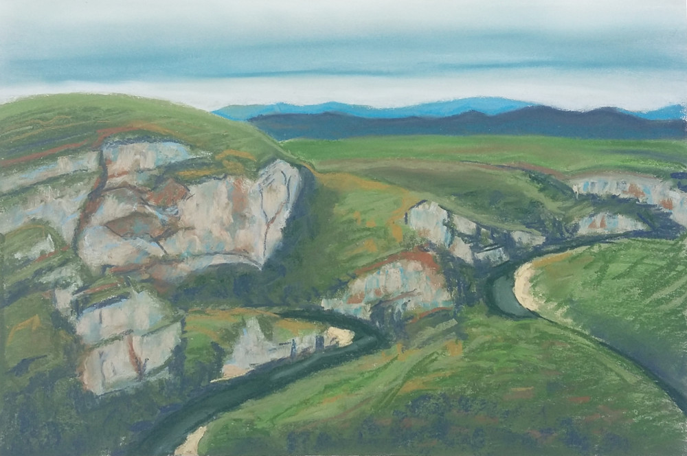
<figcaption>Ardèche, <i>Pastel on Canson Mi-Teintes Touch, 29.7x42cm</i></figcaption>

In parallel, I also explored techniques like ink or gouache. I didn't spend as
much time as I would have liked on gouache, but I like this technique a lot.
Though the material is not as beautiful and noble as oil, it is a very
interesting technique because by drying fast it allows one to work quickly, and
it gives interesting tranparency effects.
Any mistake can also be reworked, contrary to
watercolor for which you need to adopt a completely different philosophy by
accepting the lack of control. Another
advantage over pastel is that, gouache being a paint, you don't need a huge
collection of tubes to work because you can derive what you need by mixing
pigments - you do the same with pastel, but directly on the canvas, making it
more difficult to control the effect.

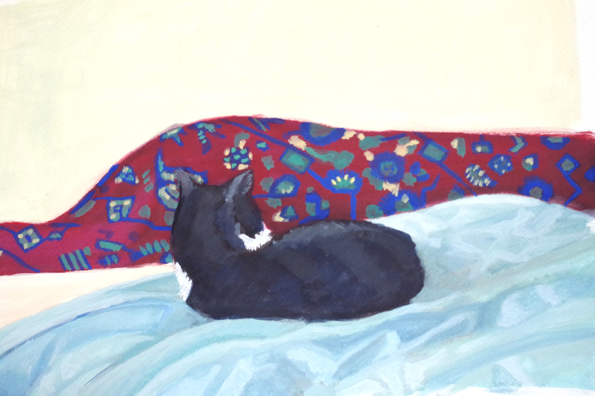
<figcaption>Cat, <i>Gouache on canvas, 32.5x25cm</i></figcaption>

After a lot of practice with pastel I became hindered by my drawing skills,
and decided to work on it it by progressively switching back to drawing without
colors, or with only a few.
I spent a lot of time playing with different types of pencil or even
with felt pens.
At some point, I
particularly enjoyed sketching with *pierre noire*, because it produces
interesting effects and allows me to work faster than with pencil. I also loved
practicing the [*trois-crayons*](https://en.wikipedia.org/wiki/Trois_crayons)
technique (3-pencils: *pierre noire*, sanguine, white, usually applied on a
mid-tone paper), a technique dating from the 16th century, which was
intensively used to make portraits.

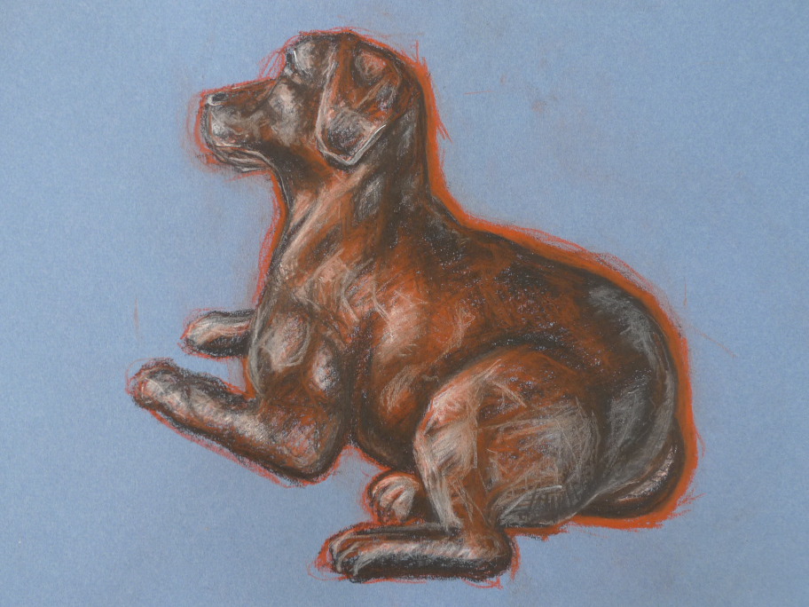
<figcaption>
Dog, <i>Pencils on colored paper, 32.5x25cm</i>
</figcaption>

I generally work from a real model rather than from a photography, because it
trains the ability to see in space and often leads to
more lively results.
It also has advantages, like the possibility of moving
around, getting closer, seeing the model from a different perspective in order
to comprehend it better. I particularly enjoy drawing from statues in museums, or
going to the *Jardin des Plantes* to draw real, living animals.
I either wait for them to repeatedly go to the same position when they wander
around or circle in their enclosures, at which point I quickly add more strokes
to my sketch, or just try to capture the idea of their movement when they move
too much (damn monkeys...).
I also love going to live model sessions in Montmartre or elsewhere, especially
with friends.

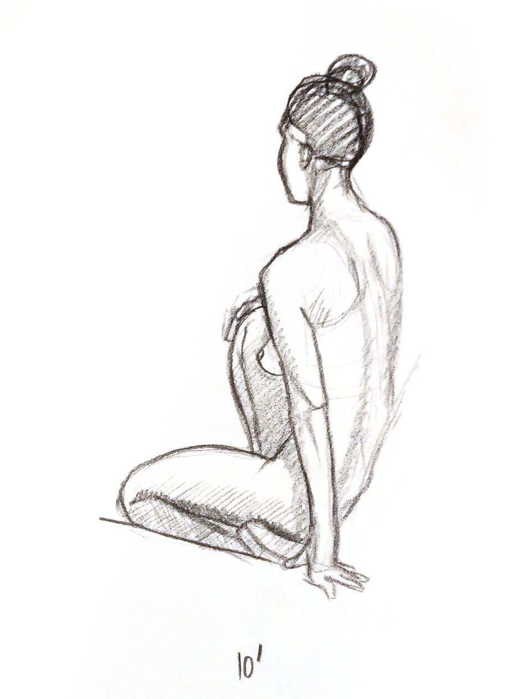
<figcaption>Live model (10 min.),
<i>Pierre noire</i>.
</figcaption>

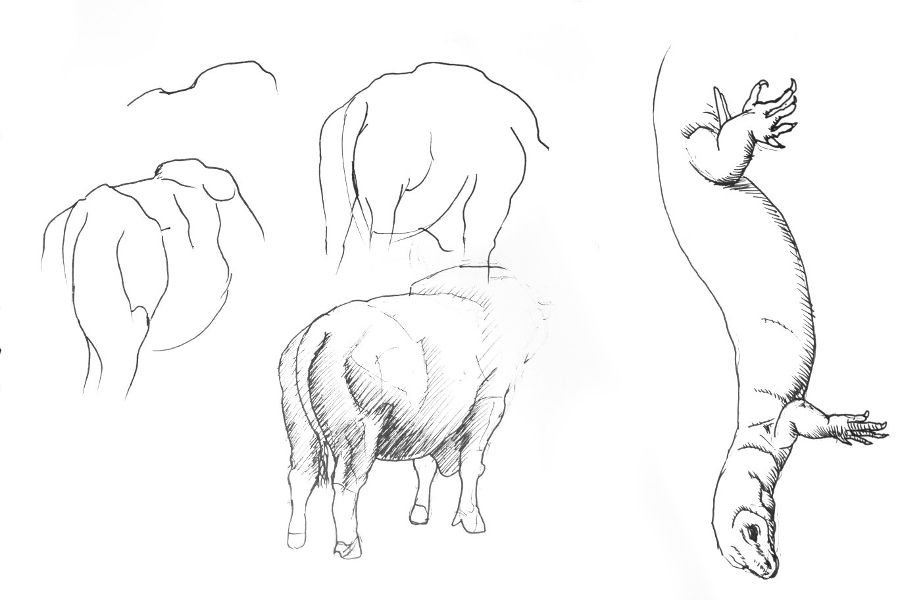
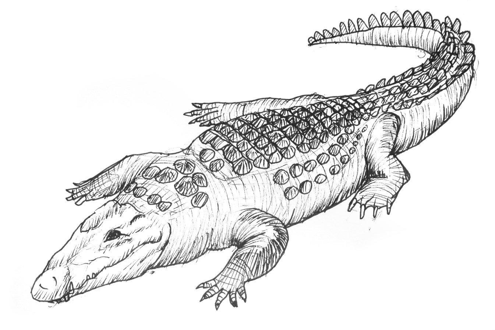
<figcaption>Sketching living animals at <i>Jardin des plantes</i>, <i>Felt pen</i>.
</figcaption>

Lately, I've focused on drawing with simple pencils because it is very
demanding.
While you can easily get interesting effects with techniques like
charcoal or pierre noire, pencils are very neutral and, in a
way, lack personality. If you draw a stroke with pierre noire, the stroke is
interesting in itself and can give strength to your drawing. On the contrary,
there is nothing more boring than a pencil stroke.
Using pencils thus takes more time and
forces you to be extremely strict and rigorous, but on the other hand gives you
a lot of control and leads to very subtle and interesting results. It also makes
you learn a lot - a lot more than the other techniques.

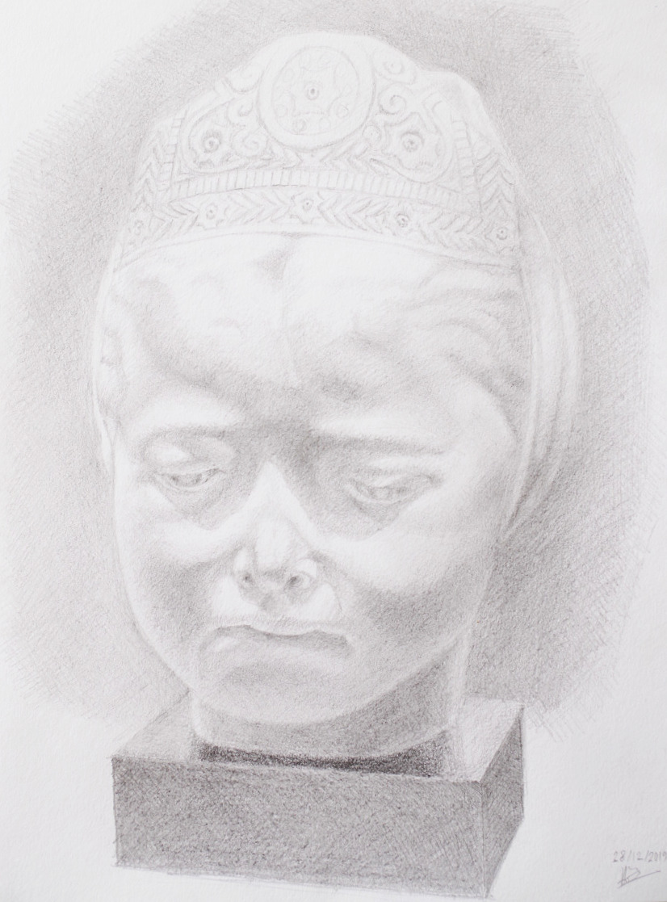
<figcaption>Sculpted head, <i>Pencil, 29.7x42cm.</i></figcaption>

  

  

  

  <b>Whenever I need to buy art material, I go to
  <a href="https://www.magasinsennelier.art"><i>Sennelier</i></a></b>, at quai
  Voltaire in Paris, a historical store dating from 1887. Sennelier is also a
  brand, and a good one. The founder, Gustave Sennelier, had a training 
  in chemistry and started his shop by creating his own colors for
  artists. Most of my pastel sticks are actually from there.
  

  

  
  <figcaption>
  The Sennelier shop in Paris
  </figcaption>
  

  

  I particularly like the place because of its atmosphere, and whenever one of
  my friends wants to start drawing or painting I take she/him there to get
  her/him set up. The place is a bit of a mess, and immediately
  upon entering you only see piles and piles of art supplies from the floor to
  the ceiling. The shop is not big, but the selection is huge: it is
  more complete and diverse and actually cheaper than many other, bigger shops I
  went to. While I don't like shopping very much, I love going there just
  to "dig" and look for interesting 
  things. Of course, I always end up buying something I didn't came for.
  

 
  

  The people working there are also nice and know a lot about the products
  they sell, meaning they always give good advice whenever you need some.
  For me, going there is a bit like 
  going to Shakespeare and Company for someone who loves English literature.
  

  

 

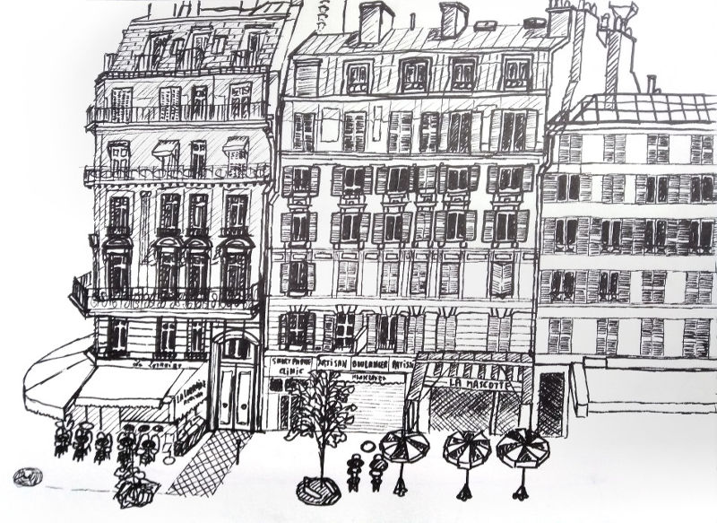
<figcaption>Parisian street, <i>Felt pen, 21x29.7cm.</i></figcaption>

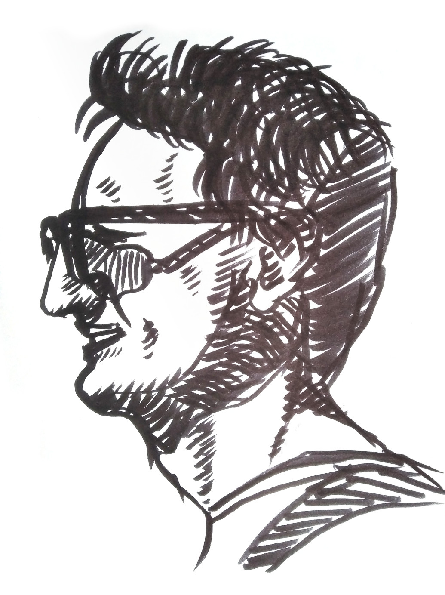
<figcaption>Portrait, <i>Felt pen, 29.7x21cm.</i></figcaption>

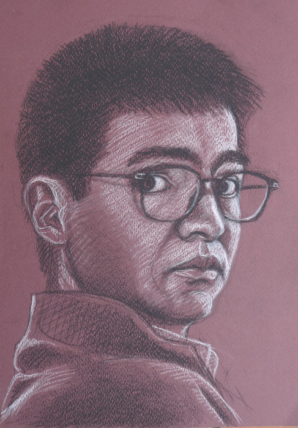
<figcaption>Self-portrait (executed with a mirror),
<i>Pierre noire and white pencil on colored paper, 42x29.7cm.</i>
</figcaption>

  

  

  <b>My favourite museum in Paris is <i>musée d'Orsay</i></b>. I love the paintings,
  and I used to go there with friends to draw the sculptures (they have an
  amazing collection!). After the drawing session, we would
  then head to one of the nearby cafés to have a hot drink.

  

## Computer Graphics 

<a href="assets/images/cg-town.jpg">
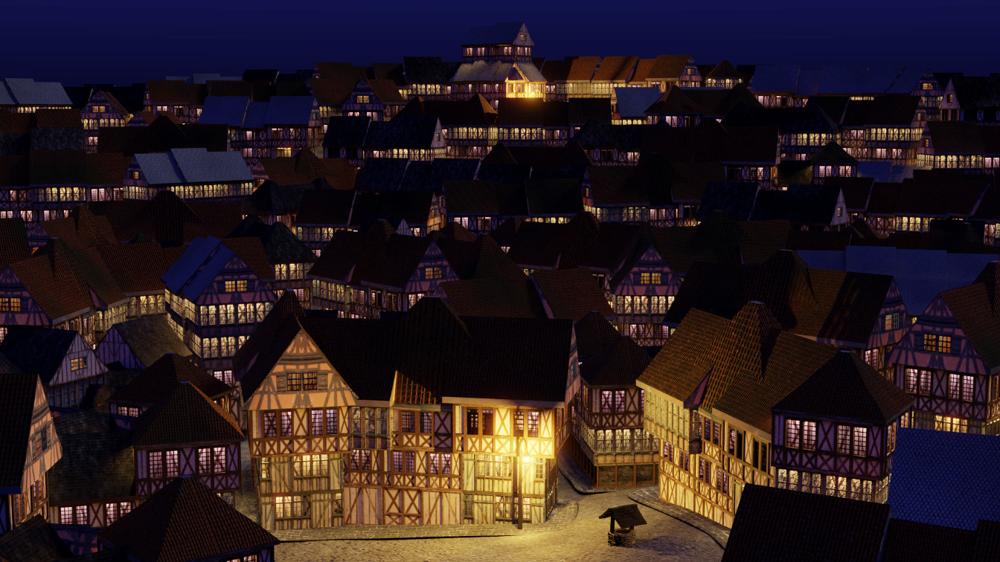
</a>
<figcaption>Old town</figcaption>

After a very long break, I recently hopped back on
[Blender](https://www.blender.org/) to have a bit of fun.

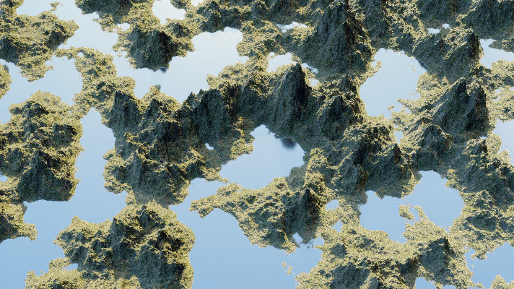
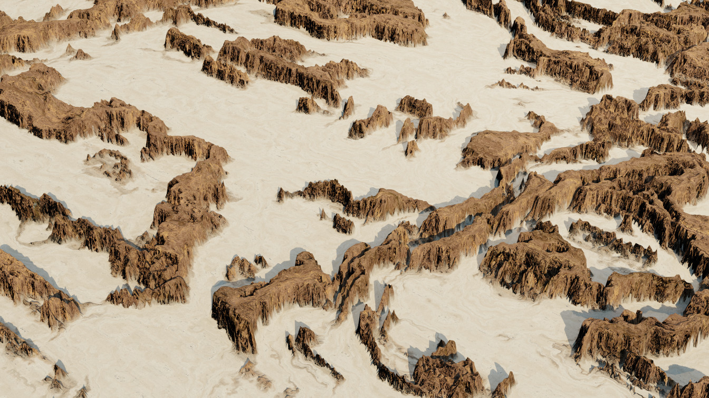
<figcaption>Procedural generation experiments
</figcaption>

I particularly love playing with shader graphs to get interesting results. It
reminds me of when I used to
[program shaders in C++ and HLSL while in high
school](https://github.com/sonmarcho/CrowdEngine).

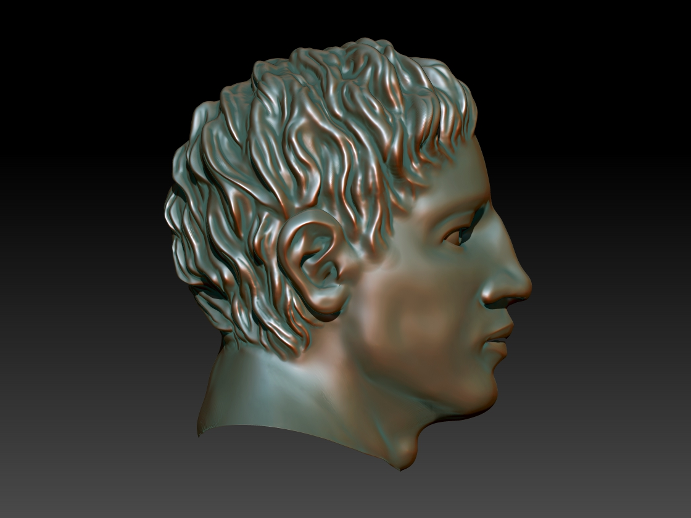
<figcaption>Sculpted head</figcaption>

You can learn more about my experiments [here](/2021/01/19/old-town.html)
or [there](/2022/12/26/sculpted-head.html).

## Mandarin Chinese 

I lived in Shanghai in 2019, which allowed me to discover the Chinese culture
and more specifically the Chinese language. I fell in love with this language,
and since then have been practicing with diligence. My dream is to have
the ability to enjoy Chinese literature in Chinese, and by enjoy I mean
not only understand the text but also grasp its subtleties and relish the style in
which it is written, all things which are lost in translation. This goal is of
course difficult, maybe to the point of being unattainable; it is
nonetheless the resolution by which I abide when I practice.

One of the main reasons why I went to Shanghai is that I had then lived almost
all my life in France and was looking for a radically different experience.
China then seemed an obvious good choice, so I went. I initially hadn't intended
to learn Chinese because it is such a difficult language, until a friend who was
also going convinced me to attend a Chinese class.

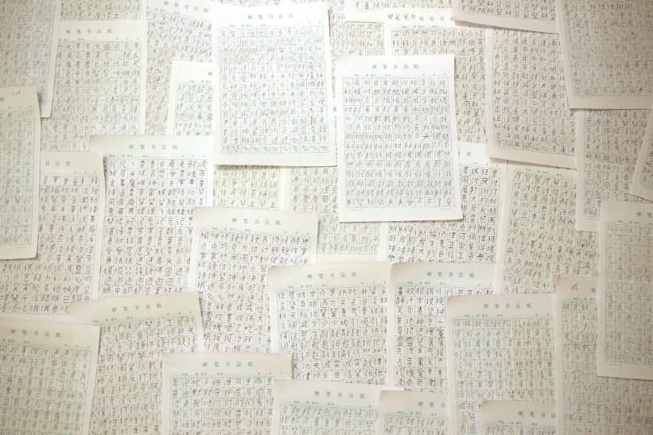
<figcaption>
Frankly, I think we should measure the time spent on learning
Chinese in kilometers of copied characters
</figcaption>

What I really loved about going to China is that the country and its culture are
so different from what I had known, and there is so much to discover, that I was
immediately destabilized. Every day brought its lot of discoveries and as a
consequence felt quite different: one has a different perception of time,
then. This feeling of discovery is also something I experienced by learning the
language. Of course, we always learn things by practicing foreign languages, but
in the case of Chinese, because the sentences and their meanings are expressed
in such a radically different manner, I immediately had the feeling I needed to
change my way of thinking whenever going from French to Chinese and vice versa.

For instance, the Chinese language can be imprecise: a lot depends on the
context. As a result, translating from French to Chinese is doomed to fail from
the very start. My Chinese teacher in Shanghai and I had countless discussions
of the form:

<blockquote style="font-style: normal">
- How would you say [some sentence] in Chinese? 
- You would say [such and such]. 
- But this doesn't express the same thing at all. How would you preserve the
  meaning? 
- Well, you <i>can't</i>.
</blockquote>

It actually drove me a bit crazy at first, because to me all natural languages
are Turing complete in a sense, meaning they should be able to express the same
things, right?

### A few words about the Mandarin grammar

Another simple example is the grammar. I've heard a lot that Chinese doesn't
have a grammar and I find this saying very wrong. It is not because a language
doesn't require to conjugate verbs that it doesn't have a complex and subtle
grammar, and I actually own a 400-page book just about this topic ([this
book](https://g.co/kgs/97M3bd)).

#### Modifying the meaning
Something fun about the Chinese grammar is the modifiers. It is for instance
possible to *modify* a noun by adding information with the structural particle
的, written <i>de</i> in pinyin, the official romanization system for Mandarin
Chinese. Note that pinyin uses accents to denote tones, but I will omit them for
simplicity: see the [dedicated section](#chinese-tones) below for more
explanations. For instance, in Chinese, "my friend" would be translated to the
following, where I add spaces for the purpose of clarity (words are normally
written stuck to each other):

<blockquote style="font-style: normal">
我 <b>的</b> 朋友 
wo <b>de</b> peng'you 
"I <b>[characterizes]</b> friend" --> i.e.: "my friend"
</blockquote>

我 / <i>wo</i> is "me" or "I", and 朋友 / <i>peng'you</i> means "friend". The
interesting point is that 的 really doesn't express possession in the first
place: in the previous sentence it simply expresses the fact that 朋友 /
<i>peng-you</i> / "friend" is characterized by 我 / <i>wo</i> / "me". In this
context, the sentence specifically means "my friend". But it is possible to use
的 to modify a noun with an adjective: again, it is all about
*characterization*.

For instance, you can use 好 / <i>hao</i> / "good" to characterize a friend:

<blockquote style="font-style: normal">
好 <b>的</b> 朋友 
hao <b>de</b> peng'you 
"good <b>[characterizes]</b> friend" --> i.e.: "(a) good friend" 
</blockquote>

You can even characterize this friend with the fact that you met her in
Shanghai, in the sense that you became friend with her while there. This is a
bit the equivalent of a relative clause:

<blockquote style="font-style: normal">
我 在 上海 见过 <b>的</b> 朋友。 
wo zai shang'hai jian'guo <b>de</b> peng'you.  
"I in Shanghai meet <b>[characterizes]</b> friend" --> i.e.: "The/a friend I met in Shanghai".
</blockquote>

Here there is something else to notice, which is that the place (在上海/ <i>zai
shang'hai</i> / "in Shanghai") preceeds the verb (见过 / <i>jian'guo</i> /
"meet"). Putting the subject aside (我 / <i>wo</i> / "I"), in Chinese we start
with the background (time then place) then talk about the details (action,
etc.).

Looking at the verb itself, we can notice it is actually made of two
parts. The first character 见 / <i>jian</i> means "to meet". The second
character 过 / <i>guo</i> expresses an experience like in: "once in my life I
have been in China". If you replace 过 with 了 / <i>le</i>, which expresses a
change of situation and consequently often marks past actions, the meaning of
the sentence changes:

<blockquote style="font-style: normal">
我 在 上海 见<b>了</b> 的 朋友。 
wo zai shang'hai jian'le de peng-you.  
"The/a friend I saw in Shanghai". (say, I saw a friend when I went there last
week)
</blockquote>

Also, I explained above that we use 的 to modify *nouns*. There actually exists
structural particles for verbs and adjectives, to describe the manner or degree: 得 /
<i>de</i> and 地 / <i>de</i>. And we could go on and on and on like this...

#### Quantifying objects
One last fun thing I really want to mention about the grammar is the
quantifiers: whenever you quantify an object ("one cat", "two cats", etc.) you
have to use a quantifier between the number and the quantified object. For
instance, "one" is 一 / <i>yi</i>, and "cat" is 猫 / <i>mao</i>. One wouldn't
simply say 一猫: a quantifier is missing. Generally
speaking, it is possible to use 个 / <i>ge</i>:

<blockquote style="font-style: normal">
一 <b>个</b> 猫 
yi <b>ge</b> mao 
"one <b>[generic quantifier]</b> cat"
</blockquote>

We can however be more specific, and being specific helps us to be understood:
the quantified noun can be ambiguous. For instance, 只 / <i>zhi</i> is
used for animals:

<blockquote style="font-style: normal">
一 <b>只</b> 猫 
yi <b>zhi</b> mao 
"one <b>[quantifier for animals]</b> cat"
</blockquote>

For long objects like roads we can use 条 / <i>tiao</i>:

<blockquote style="font-style: normal">
一 <b>条</b> 路 
yi <b>tiao</b> lu 
"one <b>[quantifier for long objects]</b> road"
</blockquote>

It applies to fish, as most of them are long:

<blockquote style="font-style: normal">
一 <b>条</b> 鱼 
yi <b>tiao</b> yu 
"one <b>[quantifier for long objects]</b> fish"
</blockquote>

There is also a quantifier for something we hold with the hand: 把 /
<i>ba</i>. For instance:

<blockquote style="font-style: normal">
一 <b>把</b> 伞 
yi <b>ba</b> san 
"one <b>[quantifier for objects held with the hand]</b> umbrella"
</blockquote>

Of course, this only scratches the surface.

### A tonal language 

Moving away from the grammar, the pronunciation is interesting. Chinese is a
tonal language, meaning you constantly have to change your tone pitch when
speaking: depending on the sound you pronounce, your voice has to go up, down or
stay flat, and the way you do it *does* change the meaning. I omitted it above,
but in pinyin we put accents on some letters to express the tones.
For instance, I listed below a few Chinese words whose pronunciation varies
only in the tone.
You should follow the direction of the accents: the first
one is flat, the second one goes up, etc.

<blockquote style="font-style: normal">
逼 / bī / "to force" (someone to do something)  
鼻 / bí / "nose"  
笔 / bǐ / "pencil"  
币 / bì / "money" (like in the Chinese currency "RMB": 人民币 / rén mín bì / "the people's money") 
</blockquote>

Note that above I actually listed the four Chinese tones, in order: first tone
is flat, second tone goes up, third tone goes down then up, fourth tone goes
down. When a Chinese speaker does pay attention to the tones, they really add
musicality to the language. On my side, I have to admit I found them quite hard
to accomodate at the beginning: it took me a while to stop nodding or at least
moving my hand up and down to accompany the tones while speaking Chinese...

  <!-- TODO: put that in the CSS -->
  

  

  

  <b>Speaking of pronunciation,</b> the accent varies a lot with the place: even
  putting dialects aside, Northerners have a specific way of speaking Mandarin,
  Southerners have a (strong) southern accent, etc.
  <!--
  I personally try to make my accent match a blend of what one can hear in
  Beijing and Shanghai. To be more specific: I try to maximize the
  differentiation between the sounds I pronounce by cherry-picking between those
  two accents, as they are quite close though people from Beijing
  distinguish some sounds in pinyin while Shanghaiese people don't, and
  vice-versa.
  -->
  

  

  Chinese people also don't
  exclusively speak Mandarin, and a good example is given by Cantonese which
  people speak in the south. Actually, from my experience, it seems that most
  people speak at least two languages. They speak Mandarin as it is the common
  langage and actually often designated as such (普通话 / <i>pǔ'tōng huà</i> /
  "common language"). But they also often speak a local language or dialect.
  For instance, Shanghaiese people speak Shanghaiese, people from Kunming speak
  Mandarin mixed with some Yunnan words and expressions, Cantonese people speak
  Cantonese, etc.
  

  

### Writing Chinese

Who could talk about Chinese without mentioning the Chinese characters? There
truly is beauty in a Chinese character, and a strong evocative
power. This is especially striking when looking at traditional Chinese
characters, that is to say characters from before the 1952 simplification in
mainland China, and which are still used in some places like Taiwan.  For
instance, the traditional character for 学 / xué / "to learn" is 學. If we
decompose it, we get:

<table cellspacing="0" style="border-collapse: collapse">
<tr style="background:rgba(0,0,0,0);">
  <td style="text-align: center">
    
    <figcaption>A pair of hands</figcaption>
  </td>
  <td style="text-align: center">
    
    <figcaption>爻 / yao, lines making up a hexagram  in the 易经 /
    <i>i'jing</i> / "Book of Changes"</figcaption>
  </td>
</tr>
<tr style="background:rgba(0,0,0,0);">
  <td style="text-align: center">
    
    <figcaption>Being incult</figcaption>
  </td>
  <td style="text-align: center">
    
    <figcaption>A child</figcaption>
  </td>
</tr>
<caption>The traditional character xué / "to learn"</caption>
</table>

**The whole character describes a child learning the hexagrams of the Book
of Changes.** It can actually be seen as forming the image of a child learning at
their parents' knees ([ref](http://www.homeinmists.com/hd/orgpage.html?page=1092)).

  <!-- TODO: put that in the CSS -->
  

  

  

  I actually heard a different explanation for the character 學, in which 爻stands
  for the stars. This gives: <b>learning is for a child to catch the stars with
  their hands</b>. I could unfortunately not find any source supporting this
  interpretation...
  

  

As illustrated with the example above, many Chinese characters can be decomposed
into simpler ones. More specifically, it is often possible to decompose a character
into a *semantic* component and a *phonetic* component. For instance, 青 / <i>qīng</i>
expresses both green and blue and designates a (set of) color(s) typically found
in landscapes, and consequently also found in paintings like the famous 山水 /
shān'shuǐ / "mountain and water". 青 is used in other characters
which have a similar pronunciation, and from which I give a selection below:

<blockquote style="font-style: normal">
- 情 / <i>qíng</i> / "(a) feeling" - 忄is a compact version of 心 / <i>xīn</i> / "heart"  
- 请 / <i>qǐng</i> / "please" (ex.: "please open the door") - 讠is a compact version of 言 / <i>yán</i> / "word"  
- 晴 / <i>qíng</i> / "fine" (about the weather) - 日 / <i>rì</i> is the "sun"  
- 清 / <i>qīng</i> / "clear" (ex.: "a clear soup") - 氵is a compact version of 水 / shuǐ / "water"  
</blockquote>

Interestingly, some characters, when used as semantic components, often
specifically identify words from a given lexical field. A simple example is 犭,
the compact version of犬 / <i>quǎn</i> / "dog", which often identifies animals:

<blockquote style="font-style: normal">
- 狼 / <i>láng</i> / "wolf" 
- 猪 / <i>zhū</i> / "pig" 
- 猫 / <i>māo</i> / "cat" 
- 狐狸 / <i>hú'li</i> / "fox" (you may have heard of 狐狸精 / <i>hú'li'jīng</i>,
the fox spirits taking the shape of seductive women) 
</blockquote>

Similarly, Chinese people designate everything which looks like an
insect, a worm or a reptile with 虫 / <i>chóng</i>, which is consequently used
in the related characters:

<blockquote style="font-style: normal">
- 蛇 / <i>shé</i> / "snake" 
- 虾 / <i>xiā</i> / "shrimp" 
- 蝴蝶 / <i>hú'dié</i> / "butterfly" 
- 蜥蜴 / <i>xī'yì</i> / "lizard" 
</blockquote>

Our last example, the character 月 / <i>yuè</i> / "moon", often identifies body parts:

<blockquote style="font-style: normal">
- 脸 / <i>liǎn</i> / "face" 
- 肚子 / <i>dù'zi</i> / "belly" 
- 脑子 / <i>nǎo'zi</i> / "brain" 
- 腿 / <i>tuǐ</i> / "leg" 
- 脚 / <i>jiǎo</i> / "foot" 
- ... 
</blockquote>

  <!-- TODO: put that in the CSS -->
  

  

  <b>Why does the moon (月) identify body parts?</b> It should actually be 肉 / <i>ròu</i> /
  "meat", whose compact version ⺼, because it is similar to 月,
  is often merged with the latter in printed text (for details and nuances, you
  can read
  <a href="https://chinese.stackexchange.com/questions/27503/whats-the-differece-between-%E6%9C%98-u6718-and-%E8%84%A7-u8127/27551#27551">
  this</a>).
  

Once again, this only scratches the surface: there are many other ways of
forming Chinese characters...

### Some notes about learning Chinese
While it is easy to learn Chinese in China, I had to adapt a bit once I was back
in France to build a proper learning environment. My way of doing it: Chinese
class once a week, tandems with some Chinese partners at least twice a week, a
bit of reading, and Chinese TV series when I have spare time. I used to learn
vocabulary with the flash card application [Anki](https://apps.ankiweb.net/),
but have stopped because it didn't prove to be that efficient. This probably
depends on your goals, though, as flash cards can be very helpful when preparing
for an examination for instance. I always focus on tandems when I don't have
much time, because I think practicing conversation is by far the most useful,
and it is also a lot of fun. Note that it is easy to find partners on
applications like [Tandem](https://www.tandem.net).

About TV series, I started with
[致我们单纯的小美好](https://www.youtube.com/watch?v=7I1SPKwTXJ0)
and am now watching [大江大河](https://youtu.be/o_IGbDIEOjo).
I'm usually not fond of sickeningly sweet and romantic dramas like
致我们单纯的小美好, but at
least it is easy to understand so I recommend it for a start.
I definitely recommend 大江大河.
Besides, I also heard a lot about the costume drama
[琅琊榜](https://youtu.be/xEdMFMLe3_o), which had a lot of success in China due to
its rich and complex plot. It is good to watch (I love the
[credits song](https://youtu.be/qzB1yoGgcoo), by the way), but not that useful to 
study Chinese unless you want to learn a lot of old and specific terms, as well as all
the possible ways of addressing someone at the imperial court (殿下, 陛下,
whatever...).

I've recently discovered the science fiction author Liu Cixin (刘慈欣) and
really love his books. If you don't know where to start, I recommend his short
novel *The Wandering Earth* (流浪地球 - don't watch the movie).
Reading proved to be my most efficient way of acquiring vocabulary.
As finding Chinese books can be difficult outside of China
and importing them is quite expensive, I buy/download ebooks for my Kobo reader.
Even online, I sometimes have trouble finding mainland books and thus often end
up buying the Taiwanese version (i.e.: with traditional characters),
but as I intend to learn calligraphy I guess it is for the best...

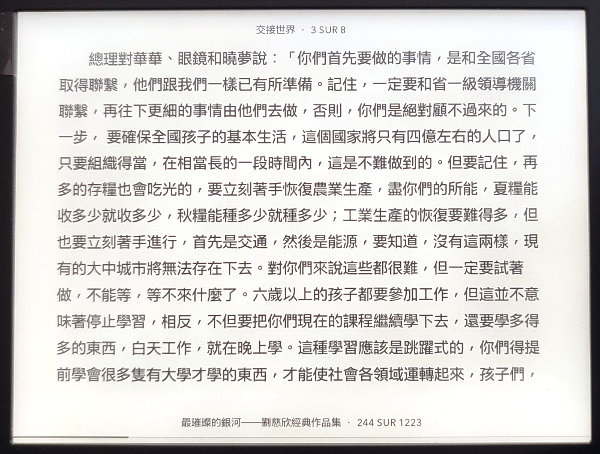
<figcaption>Supernova Era (超新星纪元), Liu Cixin (刘慈欣)</figcaption>

Also, I loved going to KTVs while in Shanghai, and ended up knowing a small
repertoire of Chinese songs. My favourites:
[小幸运](https://youtu.be/Kg-mW8SyNVg) (the movie is cute, by the way),
[小苹果](https://youtu.be/Hpnub-uM6eo) (stupid, but very fun),
[月亮代表我的心](https://youtu.be/51xS4yXbryc),
[童话](https://youtu.be/0FJ1BCbTlXg),
[平凡之路](https://youtu.be/NjTT5_RSkw4) (more generally, I really enjoy Pu
Shu / 朴树's songs),
[十年](https://youtu.be/7OdargV9K88),
[夜空中最亮的星](https://www.youtube.com/watch?v=GPnymcrXgX0),
[卡路里](https://youtu.be/3De50Nx1c5I),
[学猫叫](https://youtu.be/OHbwkZgkBIU) (don't ask why...),
[Superstar](https://youtu.be/gr5fNKK2FaA),
[刚好遇见你](https://youtu.be/aa2AhDaK_iY),
[那些年](https://youtu.be/KqjgLbKZ1h0) (I like the movie).

  

  

  <b>How to call me in Chinese</b>: 
  我是法国人，但是爸爸是越南人，所以我的名字来自越南。
  翻译成中文，它的意思是“湖山”。
  发音也差不多。如果你是中国人，可以叫我“湖山”。
  

