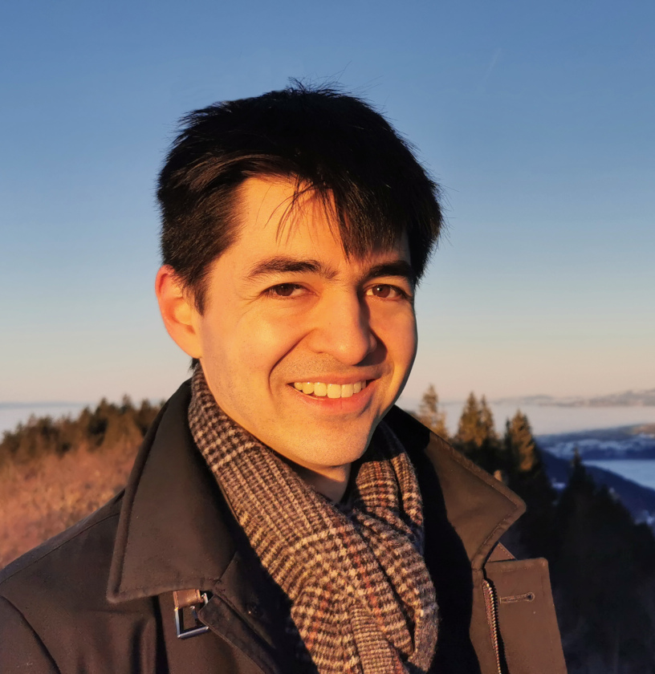

# Introduction

I am a Ph.D. candidate working at [INRIA](https://www.inria.fr/fr/centre-inria-de-paris) in
the [Prosecco](https://prosecco.gforge.inria.fr/) team, under the supervision of
[Karthikeyan Bhargavan](https://prosecco.gforge.inria.fr/personal/karthik/) and [Jonathan
Protzenko](https://jonathan.protzenko.fr/). My research field is the formal verification
of computer programs, which basically consists in applying mathematical analyses to
programs in order to check that they behave in some well-defined manner, for example that
an embedded system never crashes, or that a cryptographic protocol never reveals secret
data such as private messages or passwords.

# Motivation

My professional experience gave me the conviction that formal verification will become a
necessity in computer security. Any vulnerability left in hardware and software is indeed
of great concern when dealing with the safety of critical systems, the security of
embedded systems, and the protection of our privacy. Considering the ambitious recent
verification projects about compilers, cryptographic protocols, micro-kernels, or hardware
components, I feel this academic field is achieving maturity. However, much work remains
to democratize formal verification, since as of today it is extremely labor-intensive,
mostly relies on experts manipulating advanced tools far remote from what regular
programmers use, and still has many gaps regarding the verification of whole systems. I
thus believe we have yet to create the tools which will be widely adopted tomorrow in the
industry.

# Ongoing Work

I'm currently working on the [verification of Rust programs](1-projects.html#Aeneas), and am looking for
interns: feel free to **drop me a mail**! You can find a list of potential
internship topics
[here](/assets/documents/rust-internship-proposals.pdf).
