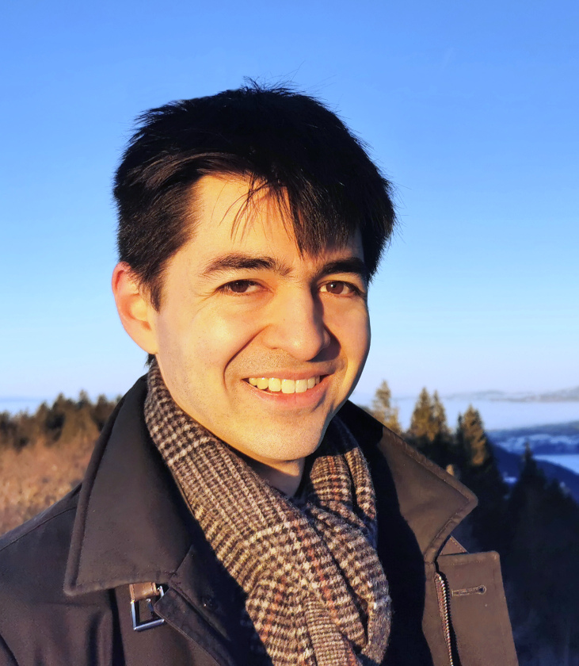

# Introduction

I am a post-doctoral researcher in the [Azure Research
team](https://www.microsoft.com/en-us/research/group/azure-research/)
in Cambdrige, UK.
Previously, I did my PhD at [INRIA](https://www.inria.fr/fr/centre-inria-de-paris) in
the [Prosecco](https://prosecco.gforge.inria.fr/) team, under the supervision of
[Karthikeyan Bhargavan](https://prosecco.gforge.inria.fr/personal/karthik/) and [Jonathan
Protzenko](https://jonathan.protzenko.fr/). My research field is the formal verification
of computer programs, which basically consists in applying mathematical analyses to
programs in order to check that they behave in some well-defined manner, for example that
an embedded system never crashes, or that a cryptographic protocol never reveals secret
data such as private messages or passwords.

# Motivation

My professional experience gave me the conviction that formal verification will become a
necessity in computer security. Any vulnerability left in hardware and software is indeed
of great concern when dealing with the safety of critical systems, the security of
embedded systems, and the protection of our privacy. Considering the ambitious recent
verification projects about compilers, cryptographic protocols, micro-kernels, or hardware
components, I believe this academic field is achieving maturity. However, much work remains
to democratize formal verification, since as of today it is extremely labor-intensive,
mostly relies on experts manipulating advanced tools far remote from what regular
programmers use, and still has many gaps regarding the verification of whole systems. I
thus believe we have yet to create the tools which will be widely adopted tomorrow in the
industry.

# Ongoing Work

I'm currently working on the [verification of Rust programs](1-projects.html#Aeneas), and
am looking for interns and collaborators: feel free to **drop me a mail**! You can find a
list of potential topics [here](/assets/documents/aeneas.html).

# News

- **2026-01-27**: I received an accessit at the [Gilles Kahn PhD thesis
  award](https://www.socinfo.fr/palmares-du-prix-de-these-gilles-kahn-2025/) from the
  French Academy of Science!
- **2025-07-25**: I presented our [tool-paper about Charon](https://arxiv.org/abs/2410.18042),
  our easy-to-use interface for rustc, at CAV in Zagreb.
- **2025-06-10**: **Microsoft just published a [blog
  post](https://www.microsoft.com/en-us/research/blog/rewriting-symcrypt-in-rust-to-modernize-microsofts-cryptographic-library/)**
  about the project I'm working on! In just a few words: Microsoft is porting its open source
  cryptographic library, notably used in Windows and Azure Linux, from trusted
  C code to *verified* Rust code. And the verification is performed by using Aeneas!
- **2025-05-03/2025-05-06**: I presented our latest progress about using Aeneas to verify
  Microsoft's cryptographic code at the **Rust Verification Workshop** and at a satellite
  event of ICSE.
- **2025-03-28**: My thesis [*Formal Verification of Rust Programs by Functional
  Translation*](papers/thesis-manuscript.pdf) received the
  [accessit of Prix de thèse GDR Sécurité Informatique](https://gdr-securite.irisa.fr/actualite/prix-de-these-2025/)!
- **2024-12-09**: I successfully **defended my PhD**! You can now call me Dr. Ho (please don't).
- **2024-11-15**: I'm now a **post-doc at Azure Research** in Cambridge (UK). I will continue
  working on the verification of Rust programs with the Aeneas toolchain, but this time
  by applying it on Microsoft's internal code.
